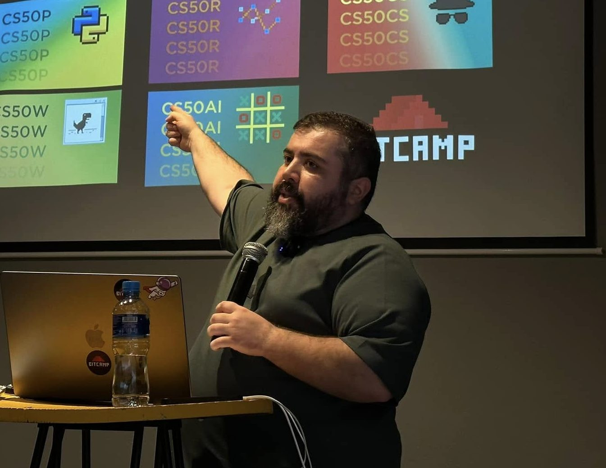

### **ყურადღება! ჩაეწერე სამენტორო ჯგუფში 👇**

გინდა მენტორი დაგეხმაროს გაუგებარი საკითხების გარკვევასა და დავალებების გაკეთებაში? ჩაეწერე სამენტორო ჯგუფში და პროფესიონალის მეთვალყურეობით გაიარე მთელი კურსი: **[https://www.bitcamp.ge/courses/python-programireba-samentoro/](https://www.bitcamp.ge/courses/python-programireba-samentoro/)**

 

მენტორი ამ კურსში განხილულ საკითხებს სხვა კუთხით შეგახედებს, დამატებით ლექციებს ჩაგიტარებს და Harvard - ის სერტიფიკატისთვის დავალებების სწორად მომზადებას გასწავლის.

 

**

რაც მთავარია!** მარტო არ მოგიწევს კურსის გავლა და არასოდეს იგრძნობ თავს გამოუვალ სიტუაციაში. როცა რამეს ვერ გაიგებ, მენტორი და ჯგუფელები დაგეხმარებიან.

 

დამატებით კითხვებისთვის მოგვმართეთ Facebook გვერდზე: **[https://www.facebook.com/bitcamp.ge](https://www.facebook.com/bitcamp.ge)**