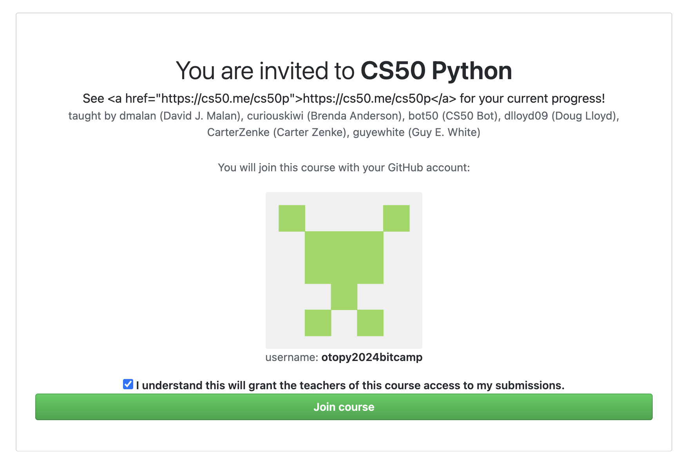

ამ ინსტრუქციის ნაბიჯ-ნაბიჯ და სწორად შესრულება აუცილებელია თუ გსურთ რომ ჰარვარდის სერტიფიკატიც აიღოთ და თქვენს მიერ შესრულებული დავალებების ავტომატური შემოწმებაც შეძლოთ ხოლმე.

**მიჰყევით ინსტრუქციას:**

1. გაიარეთ რეგისტრაცია Harvard - ის სისტემაში [ამ ბმულის გამოყენებით](https://forms.cs50.io/27a35e60-490a-4e42-8574-6b55154ae760)
2. ზედა ბმულზე რეგისტრაციის შემდეგ გკითხავს Authorize CS50? - და დააკლიკეთ Allow ღილაკს.
3. შეავსეთ Harvard - ის უნივერსიტეტის ფორმა სადაც შეიყვანთ დეტალებს თქვენს შესახებ.
4. ეწვიეთ [ამ ბმულს](https://submit.cs50.io/invites/579861a2825849178cd11315c055bc49) სადაც Github - ის ანგარიშზე წვდომის უფლება უნდა მისცეთ CS50 - ის სისტემას, მწვანე Authorize CS50 ღილაკზე დაკლიკებით.
5. მონიშნეთ თოლია და დააჭირეთ Join Course მწვანე ღილაკს:

6. გახსენით ედიტორი[ cs50.dev](https://cs50.dev/)
7. ტერმინალში გაუშვით ბრძანება: `update50`
8. თუ შემოგთავაზებთ, დააჭირეთ ღილაკს **Rebuild now**