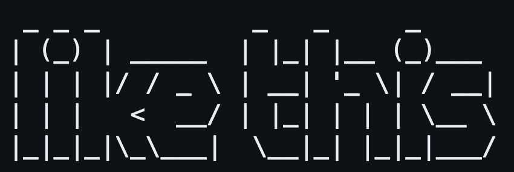
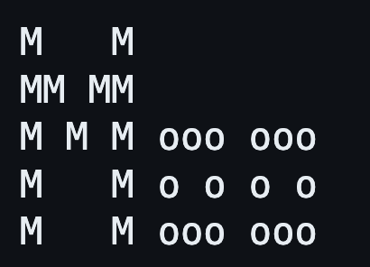

[FIGlet](https://en.wikipedia.org/wiki/FIGlet) ადრეული 90 - იანი წლების პროგრამაა რომელსაც ეს სახელი ჰქვია  [Frank, Ian, and Glen’s letters](http://www.figlet.org/faq.html) - ის მიხედვით. პროგრამის მთავარი დანიშნულება იყო ჩვეულებრივი ტექსტის დიდი ასოებით გამოტანა [ASCII art ](https://en.wikipedia.org/wiki/ASCII_art)- ის საშუალებით.

აი ასე: 



``

ეს არის იმ ფონტების ჩამონათვალი რაც FIGlet - ს ჰქონდა: [http://www.figlet.org/examples.html](http://www.figlet.org/examples.html)

**დავალება**

ფაილში სახელად figlet.py შექმენი პროგრამა რომელიც:

- მომხმარებელისგან ელოდება 0 ან 2 command line არგუმენტს.0 იმ შემთხვევაში თუ მომხმარებელს სურს ტექსტის გამოტანა random ფონტის გამოყენებით.
- 2 იმ შემთხვევაში თუ მომხმარებელს სურს თავად მიუთითოს ფონტი. ასეთ შემთხვევაში, პირველი არგუმენტი უნდა იყოს -f ან --font და მეორე არგუმენტი უნდა იყოს ფონტის დასახელება.

მომხმარებელს სთხოვს ტექსტის შეყვანას;გამოიტანს ფონტს შესაბამისი ფონტით.**

მინიშნებები:**

- რადგან ახლა უკვე ისი მოდულების გამოყენება, დააინსტალირე emoji პაკეტი რომელსაც 2 ფუნქცია მოყვება. ერთ-ერთ მათგანს კი figlet ჰქვია;
- პაკეტის სანახავად გახსენი PyPi ფეიჯი: [https://pypi.org/project/emoji/](https://pypi.org/project/emoji/)
- გადაამოწმე language='alias' დასახელებული პარამეტრიც.
- შეგიძლია დააინსტალირო pyfiglet პაკეტი:
`pip install pyfiglet`

- pyfiglet პაკეტის დოკუმენტაცია არც იმდენად კარგადაა შედგენილი, ამიტომ ამ მოდულის გამოყენებას შეძლებ ასე:
```
from pyfiglet import Figlet

figlet = Figlet()
```

`
შემდეგ შეძლებ მიიღო ფონტების სია ასე:
````
figlet.getFonts()
```

`
შეგიძლია დასეტო ფონტი ასე სადაც f არის ფონტის სახელი:
````
figlet.setFont(font=f)

```

`

შემდეგ შეგიძლია გამოიტანო ტექსტი ასე სადაც s არის ტექსტი:
````
`print(figlet.renderText(s)) `         
```

- გაიხსენე რომ random მოდულს საინტერესო ფუნქციები აქვს: [https://docs.python.org/3/library/random.html](https://docs.python.org/3/library/random.html)

#### სანამ დაიწყებ

1. Terminal - ში გაუშვი ბრძანება `cd` - ამ ბრძანების გაშვებით თავს დაიზღვევ რომ ნამდვილად შენს მთავარ ფოლდერში ხარ. 
2. შემდეგ ისევ Terminal - ში გაუშვი ბრძანება `mkdir figlet` - ამ ბრძანებით შექმნი ახალ ფოლდერს სახელად figlet შენი დავალებისთვის.
3. შემდეგ გაუშვი `cd figlet` - ამ ბრძანებით შეხვალ შენს მიერ შექმნილ figlet ფოლდერში. 

4. ახლა ამ ფოლდერში შექმენი ფაილი სახელად `figlet.py`- ამ ბრძანების გამოყენებით `code figlet.py`
5. დაიწყე დავალების შესრულება `figlet.py` ფაილში.

 

#### Demo - როგორ უნდა მუშაობდეს შენი პროგრამა?



#### როგორ უნდა გატესტო შენი პროგრამა?

როდესაც ჩათვლი რომ შედეგს მიაღწიე და გინდა დარწმუნდე რომ შენი პროგრამა სწორად მუშაობს, შეგიძლია გატესტო რამდენიმე გზით. 

##### გატესტე ხელით

- გაუშვი შენი პროგრამა python figlet.py test. პროგრამამ უნდა დაასრულოს მუშაობა sys.exit - ის გამოყენებით და გამოპრინტოს: Invalid usage.
- გაუშვი შენი პროგრამა python figlet.py -a slant. პროგრამამ უნდა დაასრულოს მუშაობა sys.exit - ის გამოყენებით და გამოპრინტოს: Invalid usage.
- გაუშვი შენი პროგრამა python figlet.py -f invalid_font. პროგრამამ უნდა დაასრულოს მუშაობა sys.exit - ის გამოყენებით და გამოპრინტოს: Invalid usage.
- გაუშვი შენი პროგრამა python figlet.py -f slant. შემდეგ აკრიფე cs50. პროგრამამ უნდა გამოპრინტოს:

- გაუშვი შენი პროგრამა python figlet.py -f rectangles. შემდეგ აკრიფე Hello, world - პროგრამამ უნდა გამოპრინტოს:

- გაუშვი შენი პროგრამა python figlet.py -f alphabet. შემდეგ აკრიფე Moo - პროგრამამ უნდა გამოპრინტოს:


##### ავტომატური გატესტვა - check50

მას შემდეგ რაც ხელით გატესტავ და ჩათვლი რომ შენი პროგრამა სავარაუდოდ სწორად მუშაობს, შეგიძლია ავტომატური ტესტირების სისტემაც გამოიყენო. 

ამისათვის Terminal - ში გაუშვი ასეთი ბრძანება 

```bash
check50 cs50/problems/2022/python/figlet
```

მწვანე სმაილები ნიშნავს რომ შენმა პროგრამამ გაიარა ტესტი. 

წითელი მოწყენილი სახეები ნიშნავს რომ შენმა პროგრამამ კონკრეტულ შემთხვევებში არასწორად იმუშავა და იმ შემთხვევების შესაბამისად უნდა გამოასწორო მანამ სანამ მწვანე სმაილს არ მიიღებ.

check50 ასევე დაგიბრუნებს მისამართს რომელსაც შეგიძლია ეწვიო და ნახო ზუსტად რა მნიშვნელობებზე გაიტესტა შენი პროგრამა.

##### როგორ გავაგზავნოთ ნამუშევარი Harvard - ის სისტემაში?

მას შემდეგ რაც ხელით და ავტომატური გატესტვავ და დარწმუნდები რომ ყველაფერი რიგზეა, submit50 - ბრძანების გამოყენებით შეგიძლია გააგზავნო შენი ნამუშევარი Harvard - ის სისტემაში.

ზუსტი ბრძანება ასე გამოიყურება: 

```bash
submit50 cs50/problems/2022/python/figlet
```

სწავლა და ბრძოლა